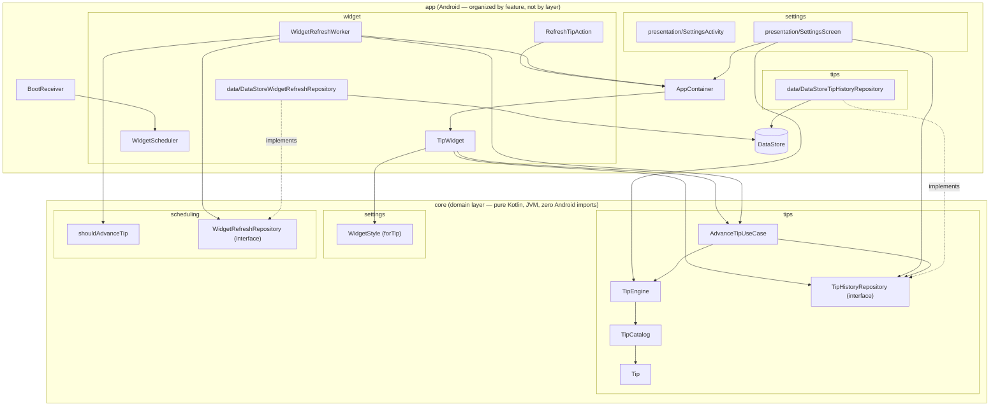

# HealthWidget


> `HealthWidget` is a working title used as the package/module name throughout this repo.
> Three name ideas for before a store listing goes out:
>
> 1. **Quiet Cue** — plainly describes the product (a quiet, occasional nudge) without
>    implying tracking or gamification.
> 2. **MicroPause** — leads with the "micro-tip, zero-friction" mechanic itself.
> 3. **Driftwell** — softer/more brandable; "drift" nods to the passive, no-dashboard
>    philosophy, "well" to the wellness framing.
>
> User-facing display text is already centralized in `strings.xml` (`app_name`, referenced
> everywhere else needs it, including the widget's brand label) so picking a final name is
> just an edit to that one file. **`applicationId` (currently `com.healthwidget.app`) is a
> separate, higher-stakes decision — see the pre-release checklist in [STATUS.md](STATUS.md)
> before the first Play Store upload.**

A privacy-first Android wellness app for students and desk workers. No accounts, no
tracking, no dashboards, no streaks, no notifications. Just a home-screen widget with one
rotating, [evidence-backed](TIP_SOURCES.md) micro-tip — the whole point is to be a quiet
presence you glance at, never something that interrupts you.

## The privacy promise

**100% offline. Zero data collected.** There is no server, no analytics SDK, no crash
reporter, no ad SDK, and the app manifest does not declare the `INTERNET` permission — so
even a compromised dependency couldn't phone home. Every setting and the tip history live in
on-device DataStore, and are included in Android's own encrypted device-backup system like
any other app's local data — see [PRIVACY.md](PRIVACY.md)'s "Backups" section for exactly
what that does and doesn't mean.

## v1 scope

v1 is intentionally passive — no notifications of any kind:

- A Glance home-screen widget showing the current tip. Tapping the tip card itself pulls a
  new one on the spot; a small gear icon opens the settings screen (AppWidgets can't
  intercept long-press, so a dedicated tap target is the only reliable way in).
- The tip advances on its own after it's actually had a chance to be seen — roughly every 90
  minutes of confirmed screen-on time since it was last shown, not a pure wall-clock timer
  that could rotate a tip nobody ever looked at (see "Notable design decisions" below).
- The widget's background is one of four styles (Forest, Ocean, Sunset, Midnight),
  deterministically derived from the currently-shown tip's text (`WidgetStyle.forTip`) rather
  than a user preference — a new tip means a new-looking card, not just new text. Not
  user-selectable; there's nothing to configure in Settings.
- A "Why this tip?" card in Settings showing the current tip's citation, with a button that
  opens the primary source in the browser, and a button to pull a different tip on demand.
- The same tip never repeats within the last 30 shown.

Explicitly **not** in v1: accounts, streaks, gamification, history/progress views,
notifications, or any form of tracking.

## Architecture

Two Gradle modules, folders organized by feature (screaming architecture) with each
feature split into `data`/`presentation` layers that depend inward on `:core` (clean
architecture) rather than on each other's concrete classes:

- **`:core`** — the domain layer: pure Kotlin, JVM-only, zero Android imports. Grouped by
  concept, not by class kind:
  - `tips/` — `Tip` (a tip's text plus its citation — `sourceLabel`/`sourceUrl`, both
    required, see `TipCatalogTest`), `TipEngine`, `TipCatalog`, `TipHistoryRepository`
    (interface), and `AdvanceTipUseCase`, the one "pick + persist the next tip" rule shared
    by every call site (the periodic tick worker, the widget's own tap-to-refresh, and the
    settings screen's manual refresh), so they can't silently diverge on anti-repeat (FR5).
    `TipHistoryRepository` tracks the last `MAX_RECENT_TIPS` (30) tips shown (by text) rather
    than just the single previous one, and `TipEngine` excludes all of them when picking the
    next tip. `TipEngine.findByText` resolves a persisted tip's text back to its full `Tip`
    (citation included) for the settings screen to display.
  - `settings/` — just `WidgetStyle`, the four background styles and `WidgetStyle.forTip`,
    the pure hash-based mapping from a tip's text to one of them. Not backed by a repository
    any more — there's no user preference left to persist, so nothing here is stored.
  - `scheduling/` — `TipRefreshSchedule` (`shouldAdvanceTip`, the tick-threshold math behind
    the ~90-minutes-of-screen-on-time tip advance) and `WidgetRefreshRepository` (interface),
    the persisted screen-on tick counter (see "Notable design decisions" below).
  Everything here is trivially unit-testable and reusable as-is by a future iOS port.
- **`:app`** — the Android application, organized by feature rather than by technical
  layer (`settings/`, `tips/`, `widget/`, `boot/`). `tips/` and `widget/` each have a `data/`
  sub-package with the DataStore-backed implementation of the matching `:core` interface
  (`DataStoreTipHistoryRepository`, `DataStoreWidgetRefreshRepository`) — dependents (workers,
  `AppContainer`, the settings screen) hold the `:core` interface type, never the concrete
  DataStore class, per the Dependency Inversion Principle. `settings/` has no `data/`
  sub-package: `presentation/` (`SettingsActivity`, `SettingsScreen`) is all there is, since
  there's no setting left to persist.



Notable design decisions:

- **The tip only advances after it's actually had a chance to be seen.** A pure wall-clock
  timer could rotate a tip nobody ever saw (screen off overnight, phone face-down all
  afternoon), so `WidgetRefreshWorker` instead ticks every `TICK_INTERVAL_MINUTES` (15,
  WorkManager's own minimum periodic interval — there's no "notify me when the screen turns
  on" primitive, and a real screen-on/off listener can't survive process death without a
  foreground service) and only counts a tick if `PowerManager.isInteractive` is true at that
  instant. `shouldAdvanceTip` (`:core`, `TipRefreshSchedule.kt`) advances the tip once
  `TICKS_UNTIL_ADVANCE` (6) such ticks — ~90 minutes of confirmed on-screen time, accumulated
  across ticks rather than requiring one unbroken session — have collected since it was last
  shown. This is a sampling approximation, not a precise stopwatch (a tick only reflects the
  instant it fired), but it's simple, needs no extra permissions or a live receiver, and the
  count is persisted (`WidgetRefreshRepository`/`DataStoreWidgetRefreshRepository`), not held
  in memory, so it survives the process dying between ticks. See `TipRefreshScheduleTest`.
- **Concurrency-safe tip advancement**: `AdvanceTipUseCase` (`:core`) wraps its
  read-history/select-tip/persist-tip sequence in a `kotlinx.coroutines.sync.Mutex`, so
  concurrent callers (the periodic tick worker, the widget's own tap-to-refresh, a manual
  refresh from Settings) can't both read the same stale history and pick the same tip. The
  mutex lives on the single `AdvanceTipUseCase` instance `AppContainer` hands out (a `by
  lazy` singleton, already required for the anti-repeat rule to hold across callers), so
  every caller shares the same lock without each construction creating a new one. See
  `AdvanceTipUseCaseTest`'s concurrent-advances test, which launches N concurrent advances
  against an N-tip pool and asserts all N tips come out distinct — a real (if narrow) race in
  the old unsynchronized version.
- **Concurrency-safe widget rendering**: pushing the widget's actual UI
  (`GlanceAppWidget.updateAll()`) is a separate step from picking the tip, and has its own
  equivalent race — three independent triggers (the periodic tick worker, the manual "get a
  different tip" button, tapping the widget itself) can call it with no ordering guarantee
  between them, and two overlapping calls can finish out of order and leave a stale render on
  screen (the real cause of the widget's background/tip only *sometimes* updating correctly).
  `AppContainer.refreshWidget()` wraps the push in its own `Mutex`, serializing every trigger
  through one call site. Each call still re-reads the current tip from DataStore at execution
  time rather than capturing a snapshot up front, so serializing just matters for the push
  itself: whichever call runs last always renders whatever is actually persisted, regardless
  of which trigger queued first.
- **A manual tip request always visibly changes something.** `TipEngine.messageFor`'s fixed,
  single-message sleep-hours tips (23:00-05:59) are exempt from anti-repeat by design for the
  passive scheduled rotation — there's only one possible message for each, so there's nothing
  to rotate. But that made an explicit tap-to-refresh (or the Settings refresh button) during
  those ~7 hours a silent no-op: the same fixed message came back every time with no visible
  change. `messageFor`/`AdvanceTipUseCase.invoke` now take a `manual` flag; when `true`, the
  sleep-hours day parts draw from the general pool instead of the fixed message, so an
  explicit request always changes the tip (and, since the background now follows the tip,
  the background too) regardless of time of day. The passive worker-driven rotation is
  untouched (`manual` defaults to `false`), so the wind-down message still shows normally
  when nobody asked for anything.
- The Glance widget's `updatePeriodMillis` is set to `0`; refresh is driven entirely by
  `WidgetScheduler`'s own 15-minute WorkManager periodic job (see the tip-advance tick model
  above), since the AppWidget framework's own update period has an unreliable 30-minute floor.
- Tip content lives in bundled plain-text resources (`core/src/main/resources/tips/*.txt`
  plus a line-for-line `*_sources.txt` citation file per pool), not a JSON asset, to avoid
  pulling a JSON dependency into a module whose whole point is to stay dependency-free.
  Every non-obvious claim a tip makes is cited in [TIP_SOURCES.md](TIP_SOURCES.md),
  organized by theme rather than by file, and enforced in code (`TipCatalog.loadDefault`,
  `TipCatalogTest`) so a tip can't ship without one.
- There's no DI framework (`AppContainer` is a hand-written composition root) and no
  ViewModel (the settings screen collects `Flow`s directly) — both are deliberately skipped
  as unnecessary weight for an app this size, not oversights.
- The widget's background is one of four real `<layer-list>` drawable resources, selected by
  `WidgetStyle.forTip` (`Math.floorMod(tipText.hashCode(), 4)`) rather than a stored
  preference — the same tip text always renders the same style, and there's no Settings UI
  for it any more since there's nothing left to choose.
- **Backup policy**: the app opts in to Android's built-in backup system and explicitly
  includes settings + tip history in both `backup_rules.xml` (legacy, API < 31) and
  `data_extraction_rules.xml` (API 31+) — chosen over excluding this data, since it's the
  option consistent with the project's existing "your local settings/history, backed up
  like any other app's" framing, and it's all non-sensitive. Both files previously pointed
  at `domain="sharedpref"`, which matched nothing (the app has no `SharedPreferences` at
  all — settings and tip history are Preferences DataStore, stored under `files/datastore/`,
  not `shared_prefs/`), so backup coverage looked configured but silently did nothing; both
  now correctly use `domain="file" path="datastore/"`. See [PRIVACY.md](PRIVACY.md)'s
  "Backups" section for what this does and doesn't mean for the user — notably, this is the
  one case where locally-stored data can leave the device (via Android's own backup
  service), which the policy is written to state plainly rather than gloss over.

## Tech stack

Kotlin · Jetpack Compose (Material 3) · Glance · WorkManager · DataStore (Preferences) ·
Gradle Kotlin DSL with a version catalog (AGP 8.10.1, Gradle 8.11.1). `minSdk 26`,
`compileSdk`/`targetSdk 36`.

## Building

Requires JDK 17.

```bash
./gradlew build
```

## Testing

```bash
./gradlew test        # unit tests (TipEngine has full branch coverage — see core/src/test)
./gradlew ktlintCheck # formatting
./gradlew lint        # Android lint
```

CI (`.github/workflows/ci.yml`) runs all three plus a full build on every push and PR.

## Roadmap

- [ ] Widget size variants (small/medium) via Glance's responsive sizing.
- [ ] Localization beyond `en` (all strings are already externalized to `strings.xml`).
- [ ] **iOS port** via WidgetKit + App Intents, sharing the same tip-selection rules (the
      `:core` module's logic is plain enough to port directly).

## License

[MIT](LICENSE).
