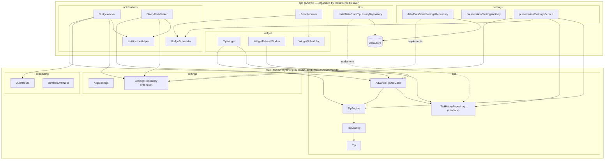

# HealthWidget


> `HealthWidget` is a working title used as the package/module name throughout this repo.
> Three name ideas for before a store listing goes out:
>
> 1. **Quiet Cue** — plainly describes the product (a quiet, occasional nudge) without
>    implying tracking or gamification.
> 2. **MicroPause** — leads with the "micro-tip, zero-friction" mechanic itself.
> 3. **Driftwell** — softer/more brandable; "drift" nods to the passive, no-dashboard
>    philosophy, "well" to the wellness framing.

A privacy-first Android wellness app for students and desk workers. No accounts, no
tracking, no dashboards, no streaks. Just a home-screen widget with one rotating,
[evidence-backed](TIP_SOURCES.md) micro-tip, and a small number of scheduled notification
nudges — including a late-night sleep alert.

## The privacy promise

**100% offline. Zero data collected.** There is no server, no analytics SDK, no crash
reporter, no ad SDK, and the app manifest does not declare the `INTERNET` permission — so
even a compromised dependency couldn't phone home. Every setting and the tip history live
in on-device DataStore only. See [PRIVACY.md](PRIVACY.md) for the plain-English policy.

## v1 scope

v1 is intentionally passive:

- A Glance home-screen widget showing the current tip, refreshed at least every 2 hours and
  on boot. Tapping it opens the settings screen.
- Four selectable widget background styles (Forest, Ocean, Sunset, Midnight), previewed live
  in Settings — the preview renders the same drawable the widget itself uses, so it never
  drifts from the real thing.
- A "Why this tip?" card in Settings showing the current tip's citation, with a button that
  opens the primary source in the browser, and a button to pull a different tip on demand.
- A single master notifications switch; turning it off silences nudges and the sleep alert
  together without discarding your frequency/quiet-hours choices, and collapses that whole
  section down to a one-line "off" status.
- 0-6 daily notification nudges (user-configurable), each a rotating micro-tip.
- One optional sleep alert at 23:00.
- User-configurable quiet hours (default 23:30-07:00) during which nudges are silent — the
  sleep alert is exempt by design.
- The same tip never repeats within the last 30 shown, across the widget and notifications
  combined.

Explicitly **not** in v1: accounts, streaks, gamification, history/progress views, or any
form of tracking.

## Architecture

Two Gradle modules, folders organized by feature (screaming architecture) with each
feature split into `data`/`presentation` layers that depend inward on `:core` (clean
architecture) rather than on each other's concrete classes:

- **`:core`** — the domain layer: pure Kotlin, JVM-only, zero Android imports. Grouped by
  concept, not by class kind:
  - `tips/` — `Tip` (a tip's text plus its citation — `sourceLabel`/`sourceUrl`, both
    required, see `TipCatalogTest`), `TipEngine`, `TipCatalog`, `TipHistoryRepository`
    (interface), and `AdvanceTipUseCase`, the one "pick + persist the next tip" rule shared
    by the widget and both notification workers, so they can't silently diverge on
    anti-repeat (FR5). `TipHistoryRepository` tracks the last `MAX_RECENT_TIPS` (30) tips
    shown (by text) rather than just the single previous one, and `TipEngine` excludes all
    of them when picking the next tip. `TipEngine.findByText` resolves a persisted tip's
    text back to its full `Tip` (citation included) for the settings screen to display.
  - `settings/` — the `AppSettings` model (notifications master switch, nudge frequency,
    sleep alert, quiet hours, widget style) and `SettingsRepository` interface.
  - `scheduling/` — `QuietHours` and `durationUntilNext`.
  Everything here is trivially unit-testable and reusable as-is by a future iOS port.
- **`:app`** — the Android application, organized by feature rather than by technical
  layer (`settings/`, `tips/`, `notifications/`, `widget/`, `boot/`). `settings/` and
  `tips/` each have a `data/` sub-package with the DataStore-backed implementation of the
  matching `:core` interface (`DataStoreSettingsRepository`, `DataStoreTipHistoryRepository`)
  — dependents (workers, `AppContainer`, the settings screen) hold the `:core` interface
  type, never the concrete DataStore class, per the Dependency Inversion Principle.



Notable design decisions:

- WorkManager has no "run at this exact clock time every day" primitive, so nudge/sleep
  workers reschedule themselves ~24h ahead after each run (`durationUntilNext`), rather
  than relying on `PeriodicWorkRequest`'s coarse, inexact intervals.
- The Glance widget's `updatePeriodMillis` is set to `0`; refresh is driven entirely by a
  2-hour WorkManager periodic job, since the AppWidget framework's own update period has an
  unreliable 30-minute floor.
- Tip content lives in bundled plain-text resources (`core/src/main/resources/tips/*.txt`
  plus a line-for-line `*_sources.txt` citation file per pool), not a JSON asset, to avoid
  pulling a JSON dependency into a module whose whole point is to stay dependency-free.
  Every non-obvious claim a tip makes is cited in [TIP_SOURCES.md](TIP_SOURCES.md),
  organized by theme rather than by file, and enforced in code (`TipCatalog.loadDefault`,
  `TipCatalogTest`) so a tip can't ship without one.
- There's no DI framework (`AppContainer` is a hand-written composition root) and no
  ViewModel (the settings screen collects `Flow`s directly) — both are deliberately skipped
  as unnecessary weight for an app this size, not oversights.
- The widget's background is rendered from the real `<layer-list>` drawable resource via
  `AndroidView`/`ImageView` interop in both the widget itself (Glance `ImageProvider`) and
  the settings screen's live preview/style swatches — Compose's own `painterResource` only
  handles vector/raster drawables, not `<shape>`/`<layer-list>` resources, and a hand-picked
  `Brush.linearGradient` stand-in would drift from the real widget over time.
- Widget re-renders triggered from the settings screen (a style change, or the manual
  "get a different tip" button) call `GlanceAppWidget.updateAll()` inside
  `HealthWidgetApp.applicationScope` (a process-lifetime `CoroutineScope`), not the settings
  screen's own `rememberCoroutineScope()`. Calling it directly from the screen's scope worked
  once, then silently stopped updating the widget until the app was force-restarted: that
  scope is cancelled if the user navigates away before the Glance composition finishes,
  apparently leaving that widget ID's Glance session stuck. Routing it through a one-time
  `WorkManager` job instead (mirroring `WidgetRefreshWorker`) fixed the stuck-session problem
  but reintroduced a multi-second lag before the user-visible change appeared — unacceptable
  for something tapped expecting instant feedback — so it now runs directly, just in a scope
  that outlives the screen instead of one that doesn't.
- A user-configurable widget refresh interval (1h/2h/4h) was built, then removed: FR1 only
  requires "at least every 2 hours," and the extra setting wasn't worth the added surface
  area. `WidgetScheduler` now hardcodes a 2-hour interval again.

## Tech stack

Kotlin · Jetpack Compose (Material 3) · Glance · WorkManager · DataStore (Preferences) ·
Gradle Kotlin DSL with a version catalog. `minSdk 26`, `compileSdk`/`targetSdk 35`.

## Building

Requires JDK 17.

```bash
./gradlew build
```

## Testing

```bash
./gradlew test        # unit tests (TipEngine has full branch coverage — see core/src/test)
./gradlew ktlintCheck # formatting
./gradlew lint        # Android lint
```

CI (`.github/workflows/ci.yml`) runs all three plus a full build on every push and PR.

## Roadmap

- [ ] Widget size variants (small/medium) via Glance's responsive sizing.
- [ ] Per-slot custom nudge times (each frequency level 0-6 still ships fixed default times).
- [ ] Localization beyond `en` (all strings are already externalized to `strings.xml`).
- [ ] **iOS port** via WidgetKit + App Intents, sharing the same tip-selection and
      quiet-hours rules (the `:core` module's logic is plain enough to port directly).

## License

[MIT](LICENSE).
