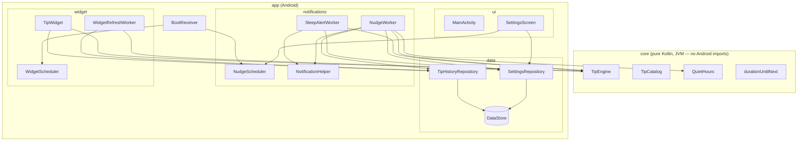

# HealthWidget


> `HealthWidget` is a working title used as the package/module name throughout this repo.
> Three name ideas for before a store listing goes out:
>
> 1. **Quiet Cue** — plainly describes the product (a quiet, occasional nudge) without
>    implying tracking or gamification.
> 2. **MicroPause** — leads with the "micro-tip, zero-friction" mechanic itself.
> 3. **Driftwell** — softer/more brandable; "drift" nods to the passive, no-dashboard
>    philosophy, "well" to the wellness framing.

A privacy-first Android wellness app for students and desk workers. No accounts, no
tracking, no dashboards, no streaks. Just a home-screen widget with one rotating,
evidence-backed micro-tip, and a small number of scheduled notification nudges —
including a late-night sleep alert.

## The privacy promise

**100% offline. Zero data collected.** There is no server, no analytics SDK, no crash
reporter, no ad SDK, and the app manifest does not declare the `INTERNET` permission — so
even a compromised dependency couldn't phone home. Every setting and the tip history live
in on-device DataStore only. See [PRIVACY.md](PRIVACY.md) for the plain-English policy.

## v1 scope

v1 is intentionally passive:

- A Glance home-screen widget showing the current tip, refreshed at least every 2 hours,
  plus on boot. Tapping it opens the settings screen.
- 0-3 daily notification nudges (user-configurable), each a rotating micro-tip.
- One optional sleep alert at 23:00.
- User-configurable quiet hours (default 23:30-07:00) during which nudges are silent — the
  sleep alert is exempt by design.
- The same tip never repeats back-to-back, across the widget and notifications combined.

Explicitly **not** in v1: accounts, streaks, gamification, history/progress views, or any
form of tracking.

## Architecture

Two Gradle modules:

- **`:core`** — pure Kotlin, JVM-only, zero Android imports. `TipEngine`, `TipCatalog`,
  `QuietHours`, and `durationUntilNext` live here so they're trivially unit-testable and
  reusable (e.g. by a future iOS port sharing the same rules, ported line-for-line).
- **`:app`** — the Android application: DataStore-backed repositories, WorkManager
  scheduling, the Glance widget, and the Compose settings screen.



Notable design decisions:

- WorkManager has no "run at this exact clock time every day" primitive, so nudge/sleep
  workers reschedule themselves ~24h ahead after each run (`durationUntilNext`), rather
  than relying on `PeriodicWorkRequest`'s coarse, inexact intervals.
- The Glance widget's `updatePeriodMillis` is set to `0`; refresh is driven entirely by a
  2-hour WorkManager periodic job, since the AppWidget framework's own update period has an
  unreliable 30-minute floor.
- Tip content lives in bundled plain-text resources (`core/src/main/resources/tips/*.txt`),
  not a JSON asset, to avoid pulling a JSON dependency into a module whose whole point is
  to stay dependency-free.
- There's no DI framework (`AppContainer` is a hand-written composition root) and no
  ViewModel (the single settings screen collects a `Flow` directly) — both are deliberately
  skipped as unnecessary weight for an app this size, not oversights.

## Tech stack

Kotlin · Jetpack Compose (Material 3) · Glance · WorkManager · DataStore (Preferences) ·
Gradle Kotlin DSL with a version catalog. `minSdk 26`, `compileSdk`/`targetSdk 35`.

## Building

Requires JDK 17.

```bash
./gradlew build
```

## Testing

```bash
./gradlew test        # unit tests (TipEngine has full branch coverage — see core/src/test)
./gradlew ktlintCheck # formatting
./gradlew lint        # Android lint
```

CI (`.github/workflows/ci.yml`) runs all three plus a full build on every push and PR.

## Roadmap

- [ ] Widget size variants (small/medium) via Glance's responsive sizing.
- [ ] Per-slot custom nudge times (v1 ships fixed default times per frequency level).
- [ ] Localization beyond `en` (all strings are already externalized to `strings.xml`).
- [ ] **iOS port** via WidgetKit + App Intents, sharing the same tip-selection and
      quiet-hours rules (the `:core` module's logic is plain enough to port directly).

## License

[MIT](LICENSE).
